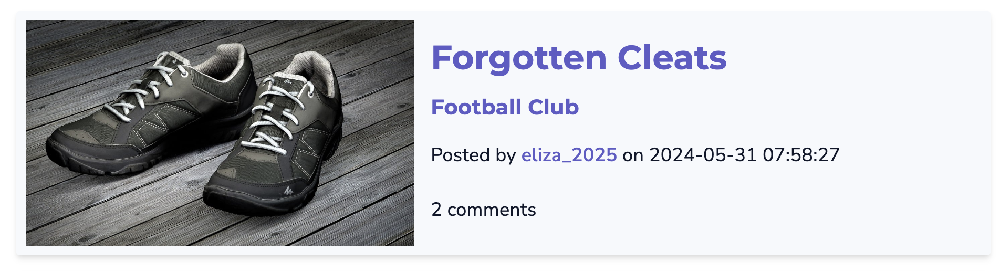

# Project Unit 4: Reddit Clone
## Success Criteria
1. A login/registration system, hashed of course.
2. A posting system to EDIT/CREATE/DELETE comments.
3. A system to add/remove likes.
4. A system to follow/unfollow users, follow/unfollow topics or groups.
5. A profile page with relevant information
6. [HLs] upload images
7. [HL++] send emails

## Criteria C: Development
### Techniques Used
- If/Else statements
- For loops
- Endpoints, HTTP methods such as GET, POST (Flask)
- Databases (SQLite)
- Codeblocks and extend (Jinja2)
- Functions
- Input validation
- Classes and methods
- Hashing
- File Input and Output

### Modules and Libraries Used
- flask
- sqlite3
- os
- string
- datetime
- random
- hashlib

### Other tools and frameworks
[ChatGPT:](https://chatgpt.com/) ChatGPT was used to reduce the time spent on populating the database with some examples content such as posts and category descriptions. An example is below:


**Fig. 1** *Example of ChatGPT being used to generate a description for a category*


**[Cirrus:](https://www.cirrus-ui.com/)**
Cirrus was used as a CSS framework for the product. Using a CSS framework allows for more consistency in the design of the product, increasing the usability of the product. 

### Development
### Use of `` and `` from Django [^1]
The use of `` and `` from Django allows for variables created in other html files to be used in the base template file. This is useful as it reduces repetition by allowing for some html code to be reused in several pages.

When creating a navigation menu that was intended to be used on multiple pages, I initially had the same html code for the navigation bar on each template. Hence, to reduce redundant code, I used this technique so that the html for the navigation bar only needed to be written once.

Below is the code for the navigation bar in the file `navbar.html` (in this case, commonly referred to as the base template):
```html
<!doctype html>
<html lang="en">
<head>
    OMMITTED FOR DEMONSTRATION
    <title></title>  # page title that will be defined in the child template
    <link rel="stylesheet" href="https://cdn.jsdelivr.net/npm/cirrus-ui/dist/cirrus.min.css">  #Cirrus CSS framework
    <link rel="stylesheet" href="/style.css">  #Custom CSS
</head>
<body>
    <div id="navbar" class="w-20p">  # div tag that contains the navigation bar
        <div id="navbar-top">
            <h3>Navigate:</h3>
            <a href="{{ url_for('home') }}">Home</a>
            <a href="{{ url_for('all_categories') }}">All Categories</a>
            
            <h4>Following Clubs:</h4>
            
                <a href="{{ url_for('get_category', cat_id=cat_id) }}">{{ categories[1][loop.index0] }}</a>
            
        </div>
        <div id="navbar-bottom">
            <a href="{{ url_for('get_profile', user_id=user_id) }}">Profile</a>
            <br>
            <a href="{{ url_for('logout') }}">Logout</a>
        </div>
    </div>
    <div id="website" class="w-80p">  # div tag that contains the rest of the content
          # content that will be defined in the child template
    </div>
</body>
</html>
```
In the header, I define the title of the given page. Considering that this is the base template in which other html pages will add onto, I use `` so that the title given to each page extending on the base template can be cutomized. The content that represents `` can be defined in the child template by placing the content between the `` and `` tags. The same thing is done within the `body` tag, where after the program for the navigation bar, I use `` which describes the rest of the content that should go into the body of the page. By assigning the CSS classes `w-20p` and `w-80p` from Cirrus to a `div` that contains the navigation bar and the content block respectively, I define the width of the navigation bar and the content. This is done as the intention is that the navigation bar should always be shown on a portion of the left hand side of the screen (20%) and the webpage contents are displayed on the remaining 80% of the screen. Furthermore, each of the `div` tags are given the ids `navbar` and `website` respectively, so that their position on the screen can be adjusted in the stylesheet `style.css` linked in the header.

Below is the CSS specified in the `style.css` file to make this work:
```css
#navbar {
    height: 100%;
    position: fixed;
    left: 0;
}

#website {
    position: absolute;
    left:20%;
}
```
The attribute `position: fixed` given to `navbar` allow for the navigation bar to be fixed on the left hand side of the screen by specifying the attribute `left: 0`. The attribute `fixed` also ensures that the navigation bar remains in the same position at all times, including when the user may scroll down the page content.

The `position: absolute` attribute given to `website` in combination with the `left: 20%` attribute specifies that the content should be displayed 20% from the left hand side of the screen. This is done so the content is displayed on the immediate right hand side of the navigation bar.

In combination with the child file, this effectively allows for the navigation bar to be displayed on the left with varying content on the right. The child template is linked to the base template by using ``.

Below is a portion of the file `home.html` which is an example of a child template that extends the base template in my program:
```html
  # extends the base template

Homepage  # title of the page

  # content of the page
        <h2>Welcome to the CLUBHOUSE, {{ user[1] }}!</h2>
        <h3><em>Where ISAKers talk all things clubs and activities.</em></h3>

        OMITTED FOR DEMONSTRATION


```
The `` links the blocks defined in this page to the blocks of the same name in `navbar.html`. For example, this page defines "Homepage" as the content to be passed for ``. Similarly, the content of the page is placed between the `` and `` tags.

The end result looks like this:

*Fig.2* **Example of the navigation bar on the home page through the use of block content and extend**


#### Use of Jinja operators and expressions to create dynamic content [^2] [^3] [^4]

In making the product, I pass variables from Python code in `app.py` when rendering HTML templates to create dynamic content customized to the user. An example of where this happens is in `category.html`:

```html

    OMITTED FOR DEMONSTRATION

    <div class="p-1">
        <h3 class="uppercase">Latest Posts from {{ details[1] }}</h3>
          <!--If there are no posts in the category-->
            <p>No posts yet! Why don't you be the first?</p>
        
        
            <div class="frame u-shadow-md u-border-1 border-light bg-light"> <!--Each Post Preview-->
                <div class="row">
                    <div class="col-5">
                         <!--If the post image is not undefined-->
                             <!--Retrieve post image-->
                        
                             <!--Retrieve a default image-->
                        
                    </div>
                    <div class="col-7">
                        <div class="space"></div>
                        <a class="u u-LR" href="{{url_for('get_post', post_id=post[0])}}"><h3>{{ post[3] }}</h3></a>
                        <a class="u u-LR" href="{{url_for('get_category', cat_id=post[5])}}"><h6>{{ post[6] }}</h6></a> <!--Post Category-->
                        <p>Posted by <a class="u u-LR" href="{{ url_for('get_profile',user_id=post[7])}}">{{ post[8] }}</a> on {{ post[1] }}</p> 
                        <p>{{ post[2] }} comments</p>
                    </div>
                </div>
            </div>
            <div class="space"></div>
        
    </div>

```
For example, in line 5 of the above codeblock, I use an if statement and the Jinja filter `length` to create two possible outcomes on how the page will look like. Having such conditions to show certain components when the condition is met reduces the need to create multiple similar templates for different scenarios, effectively reducing redundant code. Furthermore, providing specific messages to known conditions can help guide the user and make the website more usable, as the developer can provide feedback to the user on what to do next in these expected scenarios.

Using jinja variables also helps increase connectivity between the pages of my website. For example, in lines 20, 21, and 22, I use a jinja block to use the Flask `url_for` function and pass the correct `post_id`, `category_id`, and `user_id` values to the respective endpoints. This allows me to create a hyperlink to the post, category, and user pages from this post preview, allowing users to easily navigate between related and similar pages that they may be likely to visit next.

The variables used in these Jinja blocks are passed through when rendering the template in the `app.py` file. Below is an example of how the variables are passed in the `get_category` endpoint:

```python
@app.route('/categories/<int:cat_id>')  # Show all posts in a category
def get_category(cat_id):
    user_id = check_session(session)
    categories= retrieve_following('categories', db, user_id)
    details = db.search(f"SELECT * FROM categories WHERE id={cat_id}", False)
    posts= get_all_posts(db, choice="categories", ids=[cat_id]))
    return render_template('category.html', user_id=user_id, categories=categories, details=details, posts=posts)
```
In line 8 of the html codeblock mentioned previously, I start a for loop that loops the variable `posts` to create multiple similar `divs` that display a preview of the post. By decapsulating various post information stored in the variabe `posts` and adding it to html content using Jinja, unique post displays can be created for each post in the category. The function `get_all_posts`, which retrieves the data for the variable `posts` is defined in `library.py` as follows:

```python
def get_all_posts(db: object, choice:str, ids: list[int]):
    """Returns all posts that belong to the requested categories given as a list of either category, post, or user ids, latest posts first"""
    if len(ids) != 0:
        choices = {'categories': 'category_id',
                   'posts': 'posts.id',
                   'users': 'user_id'}
        query = "SELECT posts.id, posts.date, posts.comment_count, posts.title, posts.attachment, categories.id, categories.name, users.id, users.uname FROM posts INNER JOIN categories ON posts.category_id = categories.id INNER JOIN users ON posts.user_id = users.id WHERE "
        for id in ids:
            query += f"{choices[choice]} = " + str(id) + " OR "
        query = query[:-3] + "ORDER BY date DESC" # Remove the last OR and add ORDER BY date DESC
        return db.search(query, multiple=True)
    else:
        return []
```

This function effectively returns a list of lists, where each inner list contains (in order) the post id, date posted, comment count, post title, filename of post attachment, the id of the category the post belongs to, the category name, the author user id, and their username. This data is then passed to the html template to be displayed in the post previews. For example, in line 20, post[3] is called in the html using Jinja to display the title of the post. Similar techniques are used throughout the project to retrieve relevant information and pass it to the html template, allowing for dynamic content to be displayed on the webpage.


### Saving uploaded image files, retrieving and displaying them on the webpage [^5]
So that users can customize their profile picture and add images to their posts, I created a way for users to upload images onto the website. An example is in the template `newpost.html`, alongside the `POST` method for the endpoint `new_post` in `app.py`:

```html
<div class="new_post">
        <form method="POST" enctype="multipart/form-data">
            
            OMITTED FOR DEMONSTRATION
            
            <label for="attachment">Attachment: (optional)</label>
                <input type="file" id="attachment" name="attachment" accept="image/*">
            
            <input type="submit" value="Create Post">
        </form>
    </div>
```
A HTML form allows users to send files, through the use of the `input` tag with the attribute `type=file`. Users can select a file from their computer, which when the form is submitted is sent to the server. The attribute `accept="image/*` is used to prevent users from uploading file formats other than images. This is important as the intention is to display a photo on the webpage, and other filetypes may not be compatible, potentially causing errors.

```python
BASE_DIR = os.path.abspath(os.path.dirname(__file__))
UPLOAD_DIR = os.path.join(BASE_DIR, 'static/images')
app.config['UPLOAD_FOLDER'] = UPLOAD_DIR

@app.route('/uploads/<filename>')
def get_img(filename):
    return send_from_directory(UPLOAD_DIR, filename)

@app.route('/<filename>')
def get_default_img(filename):
    return send_from_directory(os.path.join(BASE_DIR, 'static'), filename)
```
The photos must be uploaded somewhere, hence, I specify the directory where the images will be saved, In this case, I chose to upload the photos to the `images` folder in `static`. Hence, to get the path to the folder, I use the `os` module. The variable `BASEDIR` defined in the first line retrieves the path to where the file `app.py` is located. The variable `UPLOAD_DIR` concatenates this path with the path from the project to the `images` folder for the final directory. The `app.config['UPLOAD_FOLDER']` is set to the `UPLOAD_DIR` which is a way of telling the Flask application that this is the directory where images are being saved.

Next, I define endpoints to retrieve the uploaded images in my webpages. I created the first endpoint, `get_img`, to retrieve and load images from the upload directory. Using the function `send_from_directory` from Flask, the image data can be loaded on the webpage. I chose to also create a second endpoint, `get_default_img` to retrieve images that I have uploaded as placeholders when the user chooses not to upload an image. I chose to do this to maintain consistency in the design of my website by allowing some components that expect an image to displayed even when missing an image from the user.

Using `['UPLOAD_FOLDER']`, I can now save the image from the `POST` request in the previous html `form` to the specified directory. The code below is from the `POST` method for the endpoint `new_post` in `app.py`:

```python
@app.route('/categories/<int:cat_id>/post/new', methods=['GET', 'POST'])  # User can create new post in category
def new_post(cat_id):
    
    PORTIONS OMITTED FOR DEMONSTRATION
    
    if request.method == 'POST':
        user_id = check_session(session)
        title = request.form.get('title')
        content = request.form.get('content')

        file = request.files['attachment']
        if file:
            filename = str(datetime.now().strftime("%Y-%m-%d-%H-%M-%S-")) + file.filename
            file.save(os.path.join(app.config['UPLOAD_FOLDER'], filename))
        else:
            filename = None
        db.run_query(f'INSERT INTO posts (title, content, attachment, user_id, category_id) VALUES ("{title}", "{content}", "{filename}",{user_id}, {cat_id})')
        return redirect(url_for('get_category', cat_id=cat_id))
```

At submission of the form, a `POST` request is sent to the server, hence by using an if statement it can be specified what to do with the information from the form. Unlike when retrieving other data forms from the html `form` tag, the image must be retrieved using `request.files[inputname]`, and is saved as the variable `file`.

In the next line, if `file` is defined, the current timestamp, retrieved using the `datetime` module, is concatenated with the name of the image file. This idea was recommended to me by an advisor. This works to prevent errors when a user uploads the file with the same name as a file that already exists in the directory, as timestamps are almost completely unique due to the nature of time. However, a weakness of this method is that images that already exist in the directory will be duplicate saved under a different name, potentially taking up space.

The file is then saved to the directory specified in the app as `['UPLOAD_FOLDER']` using the `save` method. By joining the path of the destination directory and the filename, the image is effectively saved in the directory. Finally, a sqlite query is run to insert the new post into the database, which includes the filename of the image that it was saved as so that it can be retrieved using the endpoints defined earlier.


### Sending an email to relevant users when a new post is created or a  post is updated [^6]
A system to send emails to users to inform users of updates was attempted to be implemented. First, there is a need to configure the mail provider in `app.py`. Some placeholder values are placed in the code below:

```python
from flask_mail import Mail, Message


# Only for Demonstration, as smtp server is not available
app.config['MAIL_SERVER']= 'emailserver.com'
app.config['MAIL_PORT'] = 123
app.config['MAIL_USERNAME'] = 'example@domain.com'
app.config['MAIL_PASSWORD'] = '*******'
app.config['MAIL_USE_TLS'] = True
mail = Mail(app)
```
The defined values are all attributes that need to be set to configure the mail server. If this is done correctly (which couldn't be done as I don't have access to an SMTP server that allows for the sending of emails from a web application), the Flask-Mail extension can be used. The Flask-Mail extension allows for the sending of emails from the Flask application.

I then defined functions to retrieve the email addresses of possible recipients of the email. `recipients_from_post` and `recipients_from_category` are functions that return a list of email addresses of users who have interacted with a given post and users who follow a given category respectively. These functions are defined in `library.py`:
```python
def recipients_from_post(db:object, post_id:int)->list[str]:
    """Returns a list of email addresses of users who have interacted with a given post."""
    ids = []
    # Get the author of the post
    ids.append(db.search(f"SELECT user_id FROM posts WHERE id = {post_id}", multiple=False))
    # Get the users who have commented on the post
    commenters = db.search(f"SELECT user_id FROM comments WHERE post_id = {post_id}", multiple=True)
    for id in commenters:
        if id not in ids:
            ids.append(id)
    # Get the users who have saved the post
    savers = db.search(f"SELECT user_id FROM users WHERE (saved_posts like '%,{post_id}') or (saved_posts like '{post_id},%') or (saved_posts like '%,{post_id},%') or (saved_posts='{post_id}')", multiple=True)[0]
    for id in savers:
        if id not in ids:
            ids.append(id)

    emails = []

    for u_id in ids:
        emails.append(db.search(f"SELECT email FROM users WHERE id = {u_id[0]}", multiple=False)[0])

    return emails

def recipients_from_category(db:object, cat_id:int)->list[str]:
    """Returns a list of email addresses of users who follow a given category."""
    emails = []
    ids = db.search(f"SELECT id FROM users WHERE (saved_cats like '%,{cat_id}') or (saved_cats like '{cat_id},%') or (saved_cats like '%,{cat_id},%') or (saved_cats='{cat_id}')", multiple=True)

    for u_id in ids:
        emails.append(db.search(f'SELECT email FROM users WHERE id = {u_id[0]}', multiple=False)[0])

    return emails
```

In both functions, a list of user ids is first retrieved using a search query. Whereas it is easy to retrieve the users who have posted a post or comment, it is more difficult to find the users who have saved a given post or follow a category. This is due to the structure of my database tables, as ids of posts, categories, and users followed by a given user are put together into one comma-separated string such as "1,2,3". This reflects a weakness in the organization of my program, as individual relationships between a user and a post, category, or another user are not saved, but rather grouped by the user in a form that it must be retrieved, parsed, and queried to find the individual relationships. However, I used logical thinking to identify that when ids are saved in this format, if looking for a specific value, there are only four possible ways in which it can be saved: at the start ('id,') of the string, at the end (',id'), in the middle (',id,'), or alone ('id'). Hence, I used the `like` operator and the wildcard `%` in the query to check for every single possibility, and if there are any matches, the user id is appended to the list of ids. A for loop to loop the resultant ids is used to retrieve the email addresses of the users from the database and append them to the final list of emails, which is returned.

Using these functions, I can now pass the email addresses of the recipients into the email. To send a email, I defined a function `send_email` in `library.py`:

```python
def send_email(mail:Mail, recipients:list[str], subject:str, content:str, sender:str='example@domain.com'):
    msg = Message(subject=subject, sender=("UWC ISAK Clubhouse", sender), recipients=recipients)
    msg.body = content

    print(f"""Email to be sent:
    Subject: {subject}
    Sender: {sender}
    Recipients: {recipients}""") # For demonstration purposes

    mail.send(msg) # Will not work as the email server is not set up
    return "Email Sent"
```
The function takes the Flask-Mail object, the sender address, a list of recipients which can be retrieved from one of the functions defined previously, the subject of the email, and the content of the email, and the sender of the email as arguments. The variable `msg` which is a object of the class `Flask-Message` contains the details of the mail aside the body, to be sent. The `body` attribute of the message is set to the `content` argument. The email is then sent using the `send` method of the `Mail` object. However, as the email server is not set up, instead, I chose to print what the email would approximately look like. The function returns a string "Email Sent" to indicate that the email has been sent.

This function is then used when the user has been redirected after a successful `POST` method in the `get_post` endpoint or `new_comment` endpoint, which add a new post or comment to the database.


## Criteria D: Functionality
### Video of proposed solution
The video can be found under the name "Project 4- Reddit Clone.mp4" in this Google Drive Folder: 
https://drive.google.com/drive/folders/1tMNTtgjcs2QFEaba9YF4Wc9Ikm9p6jiU?usp=drive_link

## Criteria E: Evaluation
 As displayed in criteria D, my product meets all the required success criteria, with the exception of sending an email.
### Client Feedback

*Fig. 3* **Email from client with feedback on the product**

To evaluate my product, I reached out to a peer that was identified as  one of the intended clients (a student of the same school that participates in various clubs). I gave them a chance to watch my video of the proposed solution, test the product themselves, and I asked them to answer the following questions with consideration to my product. A summary of their response to each question is as follows:

**1. Does the product meet the success criteria?:**


As can be seen in *Fig. 3*, the client responded that the product for the most part met the success criteria, but there was some room for improvement. The only success criteria that was not quite met was #7, sending the email. However, they were able to confirm that they can see that the program required to send the email was present in the code. Some points of improvement mentioned in relation to the functions in the success criteria are:
- Filters when registering new users to improve security, such as by requiring a certain number of characters in a password or requiring both letters and numbers.
- Being able to like posts without having to go into the post itself.
- Being able to see the number of followers a user has, as well as more details in profile pages such as a user's bio.
- Being able to preview an uploaded photo before submitting a form when creating a post, category, or updating a profile picture.

**2. Thoughts on the Usability, Accessibility and Design of the Product?:**


Again, as can be seen in *Fig. 3*, the client responded that overall, the clarity and organization of the UI made using the product intuitive and appealing. A specific strength mentioned was the use of links within text, and an underline animation upon hovering over these links. The underline animation allowed the client to know when the text was clickable. However on a similar note, a point of improvement mentioned was the lack of contrast in colors used for components. This, contrary to the use of links, made it difficult to differentiate important information from the rest of the content. Furthermore, it was identified that while the navigation bar and use of links made going between various pages easy, a search bar can be implemented for the future when the database becomes more populated with posts, categories, and users.

To summarive on the points of improvement in terms of user experience, the client suggested:
- Being able to search for posts and categories.
- Using different colors for different content to increase contrast and highlight important information, for more intuitive access.


### Other weaknesses and their improvements

Some weaknesses include the structure of my database in storing a user's following posts, as explained in criteria C. This may be improved by utlizing a one-to-one table that links the user_id to only one specific user_id, category_id, or post_id. This will also make it much simpler to toggle between followed and unfollowing status, as this can be done in one `DELETE` or `INSERT` query. Searching for the number of saved times/follwers will also be easier this way, by using `SELECT count(*)` can be used in a query whereas with the current structure, there is a need to locate if a certain id is stored in a column of a certain row, and then totalled together for the amount of times it appears in the entire table.

Another potential improvement is to reduce repetition in components besides the navigation bar that were repeated across multiple posts. For  example, this specific way of displaying posts were repeated in `home.html`, `category.html`, and `profile.html`.


*Fig. 4* **The component I designed using Cirrus that was repeated to display posts**


It may be possible for child template of the navigation bar template to be a post display template, and a child template extends on this file to add the relevant data to the post display. However, this needs to be tested, to see if it is actually possible. If this is not possible, it may also be possible to create a CSS class for a component such as this, making sub-classes such as it is done in Cirrus to label the individual content that goes on the component.


[^1]: Django, “The Django template language.” Django documentation, https://docs.djangoproject.com/en/5.0/ref/templates/language/. 
[^2]: Bloomreach. “Basic Syntax of Jinja.” Bloomreach Documentation, https://documentation.bloomreach.com/engagement/docs/jinja-syntax.   
[^3]: Bloomreach. “Jinja Data Structures.” Bloomreach Documentation, https://documentation.bloomreach.com/engagement/docs/datastructures.   
[^4]: Bloomreach. “Jinja Filters.” Bloomreach Documentation, https://documentation.bloomreach.com/engagement/docs/filters.   
[^5]: Mozilla. "<input type="file">." mdn web docs, https://developer.mozilla.org/en-US/docs/Web/HTML/Element/input/file.   
[^6]: Djuric, Malek. “How to Send Emails in Flask using SMTP or API.” Mailtrap, 12 April 2024, https://mailtrap.io/blog/flask-email-sending/#Send-emails-in-Flask-using-SMTP.