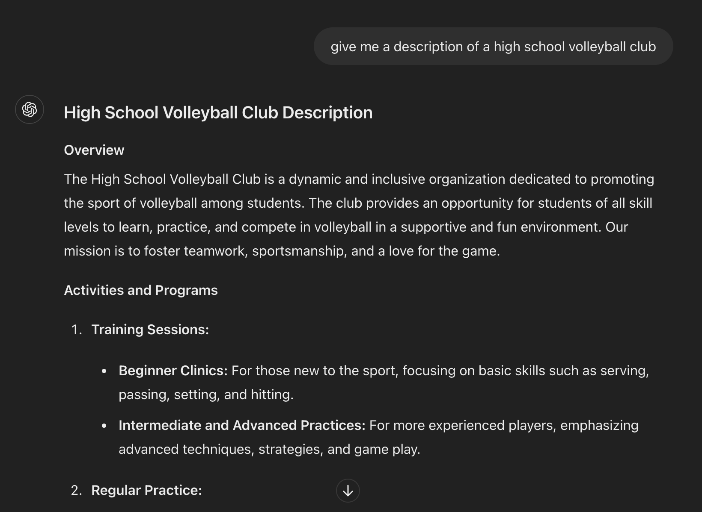

# Project Unit 4: Reddit Clone
## Brief Description of Task
1. A login/registration system, hashed of course.
2. A posting system to EDIT/CREATE/DELETE comments.
3. A system to add/remove likes.
4. A system to follow/unfollow users, follow/unfollow topics or groups.
5. A profile page with relevant information
6. [HLs] upload images
7. [HL++] send emails *(Did not do)*

## Criteria C
### Techniques Used
- If/Else statements
- For loops
- Endpoints, HTTP methods such as GET, POST (Flask)
- Databases (SQLite)
- Codeblocks and extend (Jinja2)
- Functions
- Input validation
- Classes and methods
- Hashing

### Modules and Libraries Used
- flask
- sqlite3
- os
- string
- datetime
- random
- hashlib

### Other tools and frameworks
- ChatGPT was used to reduce the time spent on populating the database with some examples content such as posts and category descriptions. An example is below:


**Fig. 1** *Example of ChatGPT being used to generate a description for a category*

- Cirrus was used as a CSS framework for the product. Using a CSS framework allows for more consistency in the design of the product, increasing the usability of the product. 

### Development
#### Use of `` and ``
The use of `` and `` in Jinja2 allows for variables created in other html files to be used in the base template file. This is useful as it reduces repetition by allowing for some html code to be reused in several pages.

When creating a navigation menu that was intended to be used on multiple pages, I initially had the same html code for the navigation bar on each template. Hence, to reduce redundant code, I used this technique so that the html for the navigation bar only needed to be written once.

Below is the code for the navigation bar in the file `navbar.html` (in this case, commonly referred to as the base template):
```html
<!doctype html>
<html lang="en">
<head>
    omited
    <title></title>
</head>

```


## Criteria D
### Video Demonstration of Product
