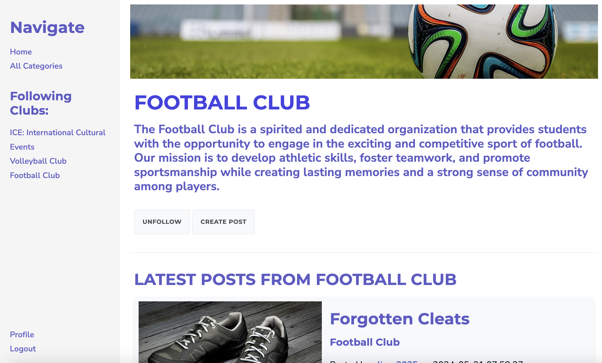
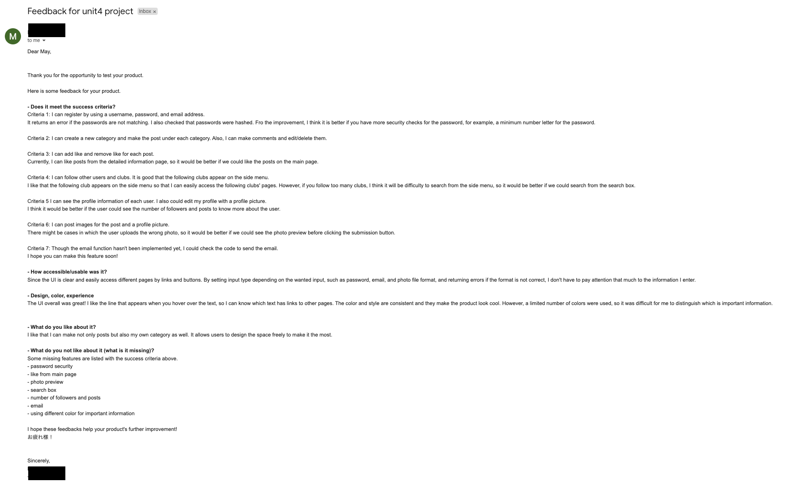

# Project Unit 4: Reddit Clone
## Brief Description of Task
1. A login/registration system, hashed of course.
2. A posting system to EDIT/CREATE/DELETE comments.
3. A system to add/remove likes.
4. A system to follow/unfollow users, follow/unfollow topics or groups.
5. A profile page with relevant information
6. [HLs] upload images
7. [HL++] send emails

## Criteria C: Development
### Techniques Used
- If/Else statements
- For loops
- Endpoints, HTTP methods such as GET, POST (Flask)
- Databases (SQLite)
- Codeblocks and extend (Jinja2)
- Functions
- Input validation
- Classes and methods
- Hashing
- File Input and Output

### Modules and Libraries Used
- flask
- sqlite3
- os
- string
- datetime
- random
- hashlib

### Other tools and frameworks
- ChatGPT
  - ChatGPT was used to reduce the time spent on populating the database with some examples content such as posts and category descriptions. An example is below:


**Fig. 1** *Example of ChatGPT being used to generate a description for a category*

- Cirrus
  - Cirrus was used as a CSS framework for the product. Using a CSS framework allows for more consistency in the design of the product, increasing the usability of the product. 

### Development
### Use of `` and `` in Jinja2
The use of `` and `` in Jinja2 allows for variables created in other html files to be used in the base template file. This is useful as it reduces repetition by allowing for some html code to be reused in several pages.

When creating a navigation menu that was intended to be used on multiple pages, I initially had the same html code for the navigation bar on each template. Hence, to reduce redundant code, I used this technique so that the html for the navigation bar only needed to be written once.

Below is the code for the navigation bar in the file `navbar.html` (in this case, commonly referred to as the base template):
```html
<!doctype html>
<html lang="en">
<head>
    OMMITTED FOR DEMONSTRATION
    <title></title>  # page title that will be defined in the child template
    <link rel="stylesheet" href="https://cdn.jsdelivr.net/npm/cirrus-ui/dist/cirrus.min.css">  #Cirrus CSS framework
    <link rel="stylesheet" href="/style.css">  #Custom CSS
</head>
<body>
    <div id="navbar" class="w-20p">  # div tag that contains the navigation bar
        <div id="navbar-top">
            <h3>Navigate:</h3>
            <a href="{{ url_for('home') }}">Home</a>
            <a href="{{ url_for('all_categories') }}">All Categories</a>
            
            <h4>Following Clubs:</h4>
            
                <a href="{{ url_for('get_category', cat_id=cat_id) }}">{{ categories[1][loop.index0] }}</a>
            
        </div>
        <div id="navbar-bottom">
            <a href="{{ url_for('get_profile', user_id=user_id) }}">Profile</a>
            <br>
            <a href="{{ url_for('logout') }}">Logout</a>
        </div>
    </div>
    <div id="website" class="w-80p">  # div tag that contains the rest of the content
          # content that will be defined in the child template
    </div>
</body>
</html>
```
In the header, I define the title of the given page. Considering that this is the base template in which other html pages will add onto, I use `` so that the title given to each page extending on the base template can be cutomized. The content that represents `` can be defined in the child template by placing the content between the `` and `` tags. The same thing is done within the `body` tag, where after the program for the navigation bar, I use `` which describes the rest of the content that should go into the body of the page. By assigning the CSS classes `w-20p` and `w-80p` from Cirrus to a `div` that contains the navigation bar and the content block respectively, I define the width of the navigation bar and the content. This is done as the intention is that the navigation bar should always be shown on a portion of the left hand side of the screen (20%) and the webpage contents are displayed on the remaining 80% of the screen. Furthermore, each of the `div` tags are given the ids `navbar` and `website` respectively, so that their position on the screen can be adjusted in the stylesheet `style.css` linked in the header.

Below is the CSS specified in the `style.css` file to make this work:
```css
#navbar {
    height: 100%;
    position: fixed;
    left: 0;
}

#website {
    position: absolute;
    left:20%;
}
```
The attribute `position: fixed` given to `navbar` allow for the navigation bar to be fixed on the left hand side of the screen by specifying the attribute `left: 0`. The attribute `fixed` also ensures that the navigation bar remains in the same position at all times, including when the user may scroll down the page content.

The `position: absolute` attribute given to `website` in combination with the `left: 20%` attribute specifies that the content should be displayed 20% from the left hand side of the screen. This is done so the content is displayed on the immediate right hand side of the navigation bar.

In combination with the child file, this effectively allows for the navigation bar to be displayed on the left with varying content on the right. The child template is linked to the base template by using ``.

Below is a portion of the file `home.html` which is an example of a child template that extends the base template in my program:
```html
  # extends the base template

Homepage  # title of the page

  # content of the page
        <h2>Welcome to the CLUBHOUSE, {{ user[1] }}!</h2>
        <h3><em>Where ISAKers talk all things clubs and activities.</em></h3>

        OMITTED FOR DEMONSTRATION


```
The `` links the blocks defined in this page to the blocks of the same name in `navbar.html`. For example, this page defines "Homepage" as the content to be passed for ``. Similarly, the content of the page is placed between the `` and `` tags.

The end result looks like this:

*Fig.2* **Example of the navigation bar on the home page through the use of block content and extend**


#### Use of Jinja operators and expressions to create dynamic content 
In making the product, I pass variables from Python code in `app.py` when rendering HTML templates to create dynamic content customized to the user. For example, in


### Saving uploaded image files, retrieving and displaying them on the webpage
So that users can customize their profile picture and add images to their posts, I created a way for users to upload images onto the website. An example is in the template `newpost.html`, alongside the `POST` method for the endpoint `new_post` in `app.py`:

```html
<div class="new_post">
        <form method="POST" enctype="multipart/form-data">
            
            OMITTED FOR DEMONSTRATION
            
            <label for="attachment">Attachment: (optional)</label>
                <input type="file" id="attachment" name="attachment" accept="image/*">
            
            <input type="submit" value="Create Post">
        </form>
    </div>
```
A HTML form allows users to send files, through the use of the `input` tag with the attribute `type=file`. Users can select a file from their computer, which when the form is submitted is sent to the server. The attribute `accept="image/*` is used to prevent users from uploading file formats other than images. This is important as the intention is to display a photo on the webpage, and other filetypes may not be compatible, potentially causing errors.

```python
BASE_DIR = os.path.abspath(os.path.dirname(__file__))
UPLOAD_DIR = os.path.join(BASE_DIR, 'static/images')
app.config['UPLOAD_FOLDER'] = UPLOAD_DIR

@app.route('/uploads/<filename>')
def get_img(filename):
    return send_from_directory(UPLOAD_DIR, filename)

@app.route('/<filename>')
def get_default_img(filename):
    return send_from_directory(os.path.join(BASE_DIR, 'static'), filename)
```
The photos must be uploaded somewhere, hence, I specify the directory where the images will be saved, In this case, I chose to upload the photos to the `images` folder in `static`. Hence, to get the path to the folder, I use the `os` module. The variable `BASEDIR` defined in the first line retrieves the path to where the file `app.py` is located. The variable `UPLOAD_DIR` concatenates this path with the path from the project to the `images` folder for the final directory. The `app.config['UPLOAD_FOLDER']` is set to the `UPLOAD_DIR` which is a way of telling the Flask application that this is the directory where images are being saved.

Next, I define endpoints to retrieve the uploaded images in my webpages. I created the first endpoint, `get_img`, to retrieve and load images from the upload directory. Using the function `send_from_directory` from Flask, the image data can be loaded on the webpage. I chose to also create a second endpoint, `get_default_img` to retrieve images that I have uploaded as placeholders when the user chooses not to upload an image. I chose to do this to maintain consistency in the design of my website by allowing some components that expect an image to displayed even when missing an image from the user.

Using `['UPLOAD_FOLDER']`, I can now save the image from the `POST` request in the previous html `form` to the specified directory. The code below is from the `POST` method for the endpoint `new_post` in `app.py`:

```python
@app.route('/categories/<int:cat_id>/post/new', methods=['GET', 'POST'])  # User can create new post in category
def new_post(cat_id):
    
    PORTIONS OMITTED FOR DEMONSTRATION
    
    if request.method == 'POST':
        user_id = check_session(session)
        title = request.form.get('title')
        content = request.form.get('content')

        file = request.files['attachment']
        if file:
            filename = str(datetime.now().strftime("%Y-%m-%d-%H-%M-%S-")) + file.filename
            file.save(os.path.join(app.config['UPLOAD_FOLDER'], filename))
        else:
            filename = None
        db.run_query(f'INSERT INTO posts (title, content, attachment, user_id, category_id) VALUES ("{title}", "{content}", "{filename}",{user_id}, {cat_id})')
        return redirect(url_for('get_category', cat_id=cat_id))
```

At submission of the form, a `POST` request is sent to the server, hence by using an if statement it can be specified what to do with the information from the form. Unlike when retrieving other data forms from the html `form` tag, the image must be retrieved using `request.files[inputname]`, and is saved as the variable `file`.

In the next line, if `file` is defined, the current timestamp, retrieved using the `datetime` module, is concatenated with the name of the image file. This idea was recommended to me by an advisor. This works to prevent errors when a user uploads the file with the same name as a file that already exists in the directory, as timestamps are almost completely unique due to the nature of time. However, a weakness of this method is that images that already exist in the directory will be duplicate saved under a different name, potentially taking up space.

The file is then saved to the directory specified in the app as `['UPLOAD_FOLDER']` using the `save` method. By joining the path of the destination directory and the filename, the image is effectively saved in the directory. Finally, a sqlite query is run to insert the new post into the database, which includes the filename of the image that it was saved as so that it can be retrieved using the endpoints defined earlier.


## Criteria D: Functionality
### Video of proposed solution
The video can be found under the name "Project 4- Reddit Clone.mp4" in this Google Drive Folder: 
https://drive.google.com/drive/folders/1tMNTtgjcs2QFEaba9YF4Wc9Ikm9p6jiU?usp=drive_link

## Criteria E: Evaluation
### Self-evaluation

### Client Feedback

*Fig. 3* **Email from client with feedback on the product**

To evaluate my product, I reached out to a peer that was identified as  one of the intended clients (a student of the same school that participates in various clubs). I gave them a chance to watch my video of the proposed solution, test the product themselves, and I asked them to answer the following questions with consideration to my product. A summary of their response to each question is as follows:

**1. Does the product meet the success criteria?:**


As can be seen in *Fig. 3*, the client responded that the product for the most part met the success criteria, but there was some room for improvement. The only success criteria that was not quite met was #7, sending the email. However, they were able to confirm that they can see that the program required to send the email was present in the code. Some points of improvement mentioned in relation to the functions in the success criteria are:
- Filters when registering new users to improve security, such as by requiring a certain number of characters in a password or requiring both letters and numbers.
- Being able to like posts without having to go into the post itself.
- Being able to see the number of followers a user has, as well as more details in profile pages such as a user's bio.
- Being able to preview an uploaded photo before submitting a form when creating a post, category, or updating a profile picture.

**2. Thoughts on the Usability, Accessibility and Design of the Product?:**


Again, as can be seen in *Fig. 3*, the client 


- Being able to search for posts and categories.
- Using different colors for different content to increase contrast and highlight important information, for more intuitive access.

2. What are the strengths of the product:

### Advisor Feedback

### Summary of Strengths, Weaknesses, and Future Improvements